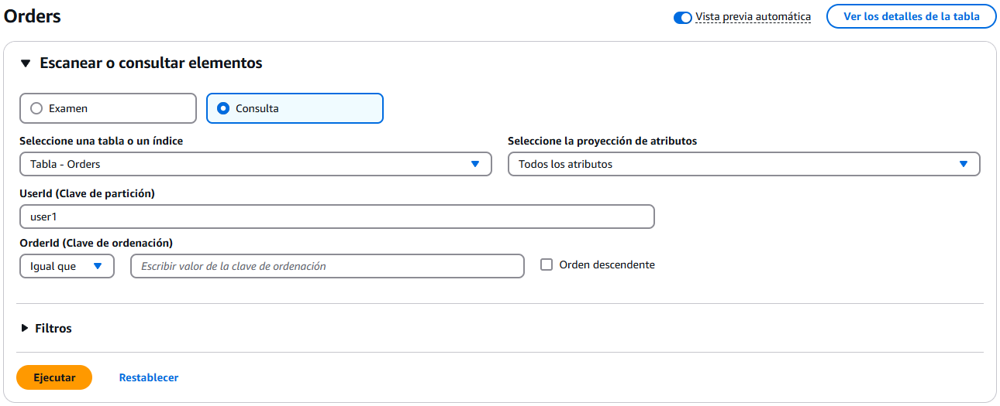

# Solución Propuesta

## Esquema Propuesto

| Campo          | Tipo       | Descripción                          |
|----------------|------------|--------------------------------------|
| UserId         | String     | Identificador del usuario(PK)          |
| OrderId        | String     | Identificador único del pedido(SK)      |
| OrderDate      | String     | Fecha del pedido (formato DD/MM/YYYY) |
| TotalAmount    | Number     | Monto total del pedido              |
| Items          | List<Map>  | Lista de productos en el pedido     |
| Items.ProductId   | String  | Identificador del producto          |
| Items.ProductName | String  | Nombre del producto                 |
| Items.ProductPrice | Number | Precio unitario del producto        |
| Items.ProductQuantity | Number | Cantidad del producto en el pedido |

---

## JSON de DynamoDB

```json
{
 "UserId": {
  "S": "user1"
 },
 "OrderId": {
  "S": "order1"
 },
 "OrderDate": {
  "S": "23/01/2025"
 },
 "TotalAmount": {
  "N": "10.99"
 },
 "Items": {
  "L": [
   {
    "M": {
     "ProductId": {
      "S": "product1"
     },
     "ProductName": {
      "S": "productExample1"
     },
     "ProductPrice": {
      "N": "5"
     },
     "ProductQuantity": {
      "N": "1"
     }
    }
   },
   {
    "M": {
     "ProductId": {
      "S": "product2"
     },
     "ProductName": {
      "S": "productExample2"
     },
     "ProductPrice": {
      "N": "6.99"
     },
     "ProductQuantity": {
      "N": "1"
     }
    }
   }
  ]
 }
}
```

---

## JSON Simplificado

```json
{
 "UserId": "user1",
 "OrderId": "order1",
 "Items": [
  {
   "ProductId": "product1",
   "ProductName": "productExample1",
   "ProductPrice": 5,
   "ProductQuantity": 1
  },
  {
   "ProductId": "product2",
   "ProductName": "productExample2",
   "ProductPrice": 6.99,
   "ProductQuantity": 1
  }
 ],
 "OrderDate": "23/01/2025",
 "TotalAmount": 10.99
}
```

---

## Forma de Consulta Propuesta

### 1. Opción 1 (JavaScript):

```javascript
const AWS = require("aws-sdk");
const dynamoDB = new AWS.DynamoDB.DocumentClient();

async function getOrdersByUser(userId) {
    const params = {
        TableName: "Orders",
        KeyConditionExpression: "PK = :userId",
        ExpressionAttributeValues: {
            ":userId": userId
        }
    };

    try {
        const result = await dynamoDB.query(params).promise();
        return result.Items;
    } catch (error) {
        console.error("Error in query:", error);
        throw error;
    }
}

// Ejemplo
getOrdersByUser("user1").then(orders => console.log(orders));
```

### 2. Opción 2 (Query con AWS CLI):

```bash
aws dynamodb query \
    --table-name Orders \
    --key-condition-expression "UserId = :userId" \
    --expression-attribute-values '{":userId":{"S":"user1"}}'
```

### 3. Opción 3 (Interfaz de DynamoDB):

En la consola de AWS, utilizar la interfaz

